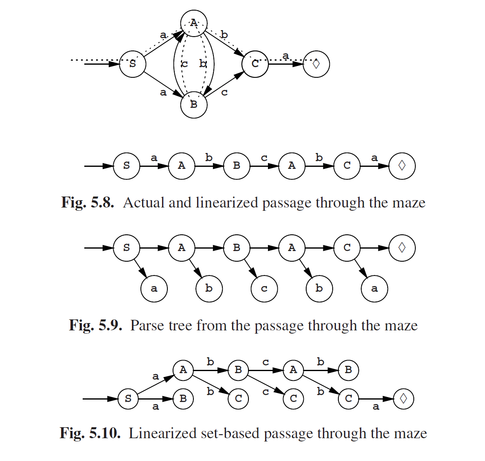

# 5.3 使用常规语法进行解析

The above automaton for producing a sentence can in principle also be used for parsing. If we have a sentence, for example, abcba, and want to check and parse it, we can view the above transition diagram as a maze and the (tokens in the) sentence as a guide. If we manage to follow a path through the maze, matching symbols from our sentence to those on the walls of the corridors as we go, and end up in ♦ exactly at the end of the sentence, we have checked the sentence. See Figure 5.8, where the path is shown as a dotted line. The names of the rooms we have visited form the backbone of the parse tree, which is shown in Figure 5.9.

But finding the correct path is easier said than done. How did we know, for example, to turn left in room S rather than right? Of course we could employ general maze-solving techniques (and they would give us our answer in exponential time) but a much simpler and much more efficient answer is available here: we split ourselves in two and head both ways. After the first a of abcba we are in the set of rooms {A, B}. Now we have a b to follow; from B there are no exits marked b, but from A there are two, which lead to B and C. So we are now in rooms {B C}. Our path is now more difficult to depict but still easy to linearize, as shown in Figure 5.10.

We can find the parsing by starting at the end and following the pointers backwards: ♦ <--- C <--- A <--- B <--- A <--- S. If the grammar is ambiguous the backward pointers may bring us to a fork in the road: an ambiguity has been found and both paths have to be followed separately to find both parsings. With regular grammars, however, one is often not interested in the parse, but only in the recognition: the fact that the input is correct and it ends here suffices.