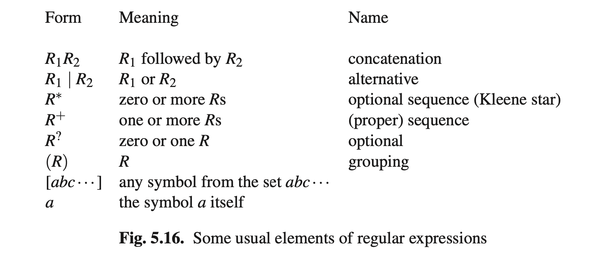

# 5.4 操作正则语法和正则表达式

如2.3.3节所述，正则语言通常由正则表达式而不是正则语法指定。例如 **[0-9]+(.[0-9]+)?**这个正则表达式，应该读作“集合0-9的一个或多个符号，后面跟着点，在后面是集合0-9的一个或多个符号”（表示包含小数点的一个数字）；还有 **(ab) * (p|q)+**应该读作“0或多个字符串**ab**后接一个或多个**p**或者**q**”（并不直接表示其含义）。正则表达式的通常形式在图Fig5.16的表中有说明，其中*R，R1，R2*是任意正则表达式；有些系统提供的形式更多，但有些提供的较少。

在计算机输入中，元符号* 和符号*之间没有区别。如果要描述的语言包含这些符号 **| *+?()[ 或 ]**，那么就需要特殊符号了。