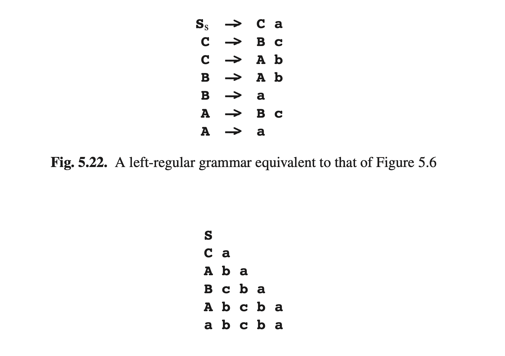
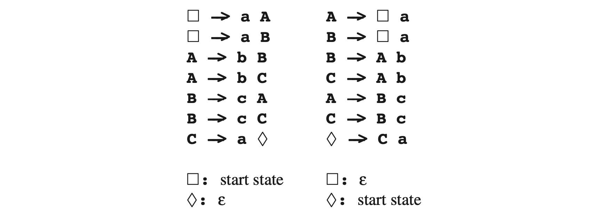

# 5.6 左规则语言

In a left-regular grammar, all rules are of the form A→a or A→Ba where a is a terminal and A and B are non-terminals. Figure 5.22 gives a left-regular grammar equivalent to that of Figure 5.6.

Left-regular grammars are often brushed aside as just a variant of right-regular grammars, but their look and feel is completely different. Take the process of pro- ducing a string from this grammar, for example. Suppose we want to produce the sentence abcba used in Section 5.3. To do so we have to first decide all the states we are going to visit, and only when the last one has been decided upon can the first token be produced:

And once the first token is available, all of them are, and we do not have any choice any more; this is vastly different from producing from a right-regular grammar.

Parsing with a left-regular grammar is equally weird. It is easy to see that initially we are in a union of all states {S,A,B,C}, but if we now see an a in the input, we can move over this a in two rules, B->a, and A->a. Suppose we use rule A->a; what state are we in now? The rule specifies no state except A; so what does the move mean?

The easy way out is to convert the grammar to a right-regular one (see below in this section), but it is more interesting to try to answer the question what a move over a in A->a means. The only thing we know after such a move is that we have just completed a production of A, so the state we are in can justifiably be described as “A finished”; we will write such a state as Af. And in the same manner the first rule in Figure 5.22 means that when we are in a state Cf and we move over an a we are in a stateSf; this corresponds to a transitionCf→aSf. Then we realize that “S finished” means that we have parsed a complete terminal production of S; so the state Sf is the accepting state ♦ and we see the rightmost transition in Figure 5.7 appear.

Now that we have seen that the rule A → Bt corresponds to the transition B f →t Af , and that the rule SS → Bt corresponds to Bf →t ♦, what about rules of the form A → t? After the transition over t we are certainly in the state Af , but where did we start from? The answer is that we have not seen any terminal production yet, so we are in a state ε f , the start state! So the rules A->a and B->a correspond to transitions εf→aAf and εf→aBf, two more components of Figure 5.7. Continuing this way we quickly reconstruct the transition diagram of Figure 5.7, with modified state names:

This exposes an awkward asymmetry between start state and accepting state, in that unlike the start state the accepting state corresponds to a symbol in the grammar. This asymmetry can be partially removed by representing the start state by a more neutral symbol, for example . We then obtain the following correspondence between our right-regular and left-regular grammar:

Obtaining a regular expression from a left-regular grammar is simple: most of the algorithm in Section 5.4.2 can be taken over with minimal change. Only the transformation that converts recursion into repetition

must be replaced by

where β consists of all the alternatives in α, with (R)∗ appended to each of them.This is because A->aA|b yields a*b but A->Aa|b yields ba*.