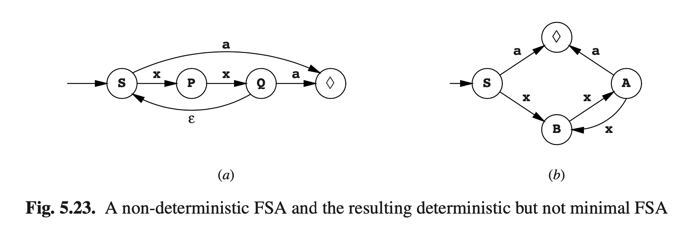

# 5.7 最小化有限状态自动机

Turning an NFA into a DFA usually increases the size of the automaton by a mod- erate factor, perhaps 10 or so, and may occasionally grossly inflate the automaton. Considering that for a large automaton a size increase of a factor of say 10 can pose a major problem; that even for a small table any increase in size is undesirable if the table has to be stored in a small electronic device; and that large inflation factors may occur unexpectedly, it is often worthwhile to try to reduce the number of states in the DFA.

The key idea of the DFA minimization algorithm presented here is that we con- sider states to be equivalent until we can see a difference. To this end the algorithm keeps the DFA states in a number of mutually disjoint subsets, a “partition.” A parti- tion of a set S is a collection of subsets of S such that each member of S is in exactly one of those subsets; that is, the subsets have no elements in common and their union is the set S. The algorithm iteratively splits each subset in the partition as long as it can see a difference between states in it.

We will use the DFA from Figure 5.23(b) as an example; it can be derived from the NFA in Figure 5.23(a) through the subset algorithm with A = SQ and B = P, and is not minimal, as we shall see.

Initially we partition the set of states into two subsets: one containing all the accepting states, the other containing all the other states; these are certainly different. In our example this results in one subset containing states S, B and A, and one subset containing the accepting state ♦.

Next, we process each subset Si in turn. If there exist two states q1 and q2 in Si that on some symbol a have transitions to members of different subsets in the current partition, we have found a difference and Si must be split. Suppose we have q1 →a r1 and q2 →a r2, and r1 is in subset X1 and r2 is in a different subset X2, then Si must be split into one subset containing q1 and all other states qj in Si which have qj →a rj with rj in X1, and a second subset containing the other states from Si. If q1 has no transition on a but q2 does, or vice versa, we have also found a difference and Si must be split as well.

In our example, states S and A have transitions on a (to the same state, ♦), but state B does not, so this step results in two subsets, one containing the states S and A, and the other containing state B.

We repeat applying this step to all subsets in the partition, until no subset can be split any more. This will eventually happen, because the total number of subsets is bounded: there can be no more subsets in a partition than there are states in the original DFA, and during the process subsets are never merged. (This is another example of a closure algorithm.)

When this process is completed, all states in a subset Si of the resulting partition have the property that for any alphabet symbol a their transition on a ends up in the same subset Si(a) of the partition. Therefore, we can consider each subset to be a single state in the minimized DFA. The start state of the minimized DFA is represented by the subset containing the start state of the original DFA, and the accepting states of the minimized DFA are represented by the subsets containing accepting states of the original DFA. The resulting DFA is, in fact, the smallest DFA that recognizes the language specified by the DFA that we started with. See, for example, Hopcroft and Ullman [391].

In our example we find no further splits, and the resulting DFA is depicted below.

